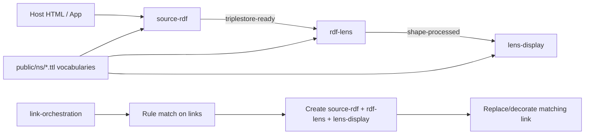

# RDF Web Components

RDF Web Components is a framework-agnostic web component stack for loading RDF, extracting shape-based data, and rendering it in templates.

It provides four components that can run independently or as a pipeline:
- source-rdf: fetches and parses RDF data (including wrx-assisted URI discovery).
- rdf-lens: applies SHACL-like extraction with rdf-lens.
- lens-display: renders extracted data into HTML templates.
- link-orchestration: auto-mounts the pipeline on matched links.

This README is written for:
- End users integrating the components in static HTML or any frontend stack.
- Developers working on this repository and component internals.

## Quick Links

- Main playground: [/playground](./src/app/playground/page.tsx)
- Demo page: [/demo](./src/app/demo/page.tsx)
- Namespace catalog: [/ns/index.html](./public/ns/index.html)

Component docs and links:
- source-rdf
  - Playground: [/source-rdf](./src/app/source-rdf/page.tsx)
  - Namespace page: [/ns/source-rdf.html](./public/ns/source-rdf.html)
  - Namespace vocabulary: [/ns/source-rdf.ttl](./public/ns/source-rdf.ttl)
- rdf-lens
  - Playground: [/lens](./src/app/lens/page.tsx)
  - Namespace page: [/ns/rdf-lens.html](./public/ns/rdf-lens.html)
  - Namespace vocabulary: [/ns/rdf-lens.ttl](./public/ns/rdf-lens.ttl)
- lens-display
  - Playground: [/display](./src/app/display/page.tsx)
  - Namespace page: [/ns/lens-display.html](./public/ns/lens-display.html)
  - Namespace vocabulary: [/ns/lens-display.ttl](./public/ns/lens-display.ttl)
- link-orchestration
  - Playground: [/orchestration](./src/app/orchestration/page.tsx)
  - Namespace catalog page: [/ns/index.html](./public/ns/index.html)
  - Config schema examples: [/demo/link-orchestrator.config.json](./public/demo/link-orchestrator.config.json)

## Architecture Overview

### High-level pipeline

1. source-rdf fetches RDF and emits triplestore-ready.
2. rdf-lens listens for triplestore-ready, loads shapes, extracts data, and emits shape-processed.
3. lens-display listens for shape-processed and renders HTML.
4. link-orchestration can automatically create and mount this full chain for matching links.

### Runtime flow



### Repository architecture

- Component runtime: [/src/rdf-webcomponents](./src/rdf-webcomponents)
- Individual component implementations: [/src/rdf-webcomponents/components](./src/rdf-webcomponents/components)
- Type contracts and events: [/src/rdf-webcomponents/types/index.ts](./src/rdf-webcomponents/types/index.ts)
- Bundled browser outputs: [/public](./public)
- Interactive docs/playgrounds (Next.js): [/src/app](./src/app)

### Build architecture

- Bundles are built with esbuild via build:webcomponents.
- Next.js static export is built via build.
- Output bundles:
  - [/public/rdf-webcomponents.js](./public/rdf-webcomponents.js)
  - [/public/source-rdf.js](./public/source-rdf.js)
  - [/public/rdf-lens.js](./public/rdf-lens.js)
  - [/public/lens-display.js](./public/lens-display.js)
  - [/public/link-orchestration.js](./public/link-orchestration.js)

## End-user Setup

### Option A: all-in-one bundle

```html
<script type="module" src="/rdf-webcomponents.js"></script>
```

### Option B: per-component bundles

```html
<script type="module" src="/source-rdf.js"></script>
<script type="module" src="/rdf-lens.js"></script>
<script type="module" src="/lens-display.js"></script>
<script type="module" src="/link-orchestration.js"></script>
```

### Minimal pipeline example

```html
<lens-display template="/demo/person-card.html">
  <rdf-lens
    config='@prefix lrdf: <https://cedricdcc.github.io/RDF-webcomponents/ns/rdf-lens.ttl#> .
[] a lrdf:RdfLensConfig ;
  lrdf:shapeFile "/demo/shapes.ttl" ;
  lrdf:shapeClass <http://example.org/Person> ;
  lrdf:multiple true .'
  >
    <source-rdf
      config='@prefix srdf: <https://cedricdcc.github.io/RDF-webcomponents/ns/source-rdf.ttl#> .
[] a srdf:SourceRdfConfig ;
  srdf:url "/demo/people.ttl" ;
  srdf:strategy "file" .'
    ></source-rdf>
  </rdf-lens>
</lens-display>
```

### Event wiring example

```html
<script>
  document.addEventListener("triplestore-ready", (e) => console.log("adapter", e.detail));
  document.addEventListener("shape-processed", (e) => console.log("lens", e.detail));
  document.addEventListener("render-complete", (e) => console.log("display", e.detail));
</script>
```

## Component Documentation

## source-rdf

Purpose:
- Load RDF from file, SPARQL, or CBD strategy and expose parsed quads.

Playground and namespace:
- Playground: [/source-rdf](./src/app/source-rdf/page.tsx)
- Namespace page: [/ns/source-rdf.html](./public/ns/source-rdf.html)
- Vocabulary: [/ns/source-rdf.ttl](./public/ns/source-rdf.ttl)

Composition:
- Usually nested inside rdf-lens.
- Can be used standalone if listening to triplestore-ready.

Attributes:
- url (string): optional override for config URL.
- config (string): inline RDF config payload.

Config vocabulary keys:
- srdf:url (required unless url attribute is set)
- srdf:format: turtle, n-triples, n-quads, rdf-xml, json-ld
- srdf:strategy: file, sparql, cbd
- srdf:subject
- srdf:subjectQuery (must be DESCRIBE or CONSTRUCT for sparql)
- srdf:subjectClass
- srdf:depth
- srdf:cache: none, memory, localStorage, indexedDB
- srdf:cacheTtl
- srdf:shared
- srdf:headers (JSON object string)

Public getters and methods:
- quads
- quadCount
- loading
- error
- cacheKey
- reload()
- refresh()

Events:
- triplestore-loading
- triplestore-ready with { quadCount, url, fromCache, duration }
- triplestore-error with { message, phase, error }

Example:

```html
<source-rdf
  config='@prefix srdf: <https://cedricdcc.github.io/RDF-webcomponents/ns/source-rdf.ttl#> .
[] a srdf:SourceRdfConfig ;
  srdf:url <https://dbpedia.org/sparql> ;
  srdf:strategy "sparql" ;
  srdf:subjectClass <http://dbpedia.org/ontology/Person> .'
></source-rdf>
```

## rdf-lens

Purpose:
- Extract structured objects from RDF quads using shape definitions.

Playground and namespace:
- Playground: [/lens](./src/app/lens/page.tsx)
- Namespace page: [/ns/rdf-lens.html](./public/ns/rdf-lens.html)
- Vocabulary: [/ns/rdf-lens.ttl](./public/ns/rdf-lens.ttl)

Composition:
- Typically wraps source-rdf.
- Emits extracted data for lens-display.

Attributes:
- config (string): inline RDF config payload.

Config vocabulary keys:
- lrdf:shapeFile (required unless lrdf:shapes is provided)
- lrdf:shapeClass
- lrdf:shapes
- lrdf:strict
- lrdf:multiple
- lrdf:subject

Public getters and methods:
- data
- loading
- error
- setQuads(quads)

Events:
- shape-loading
- shapes-loaded with { count }
- extraction-start
- shape-processed with { data, shapeClass, count, duration }
- shape-error with { message, phase, error }

Example:

```html
<rdf-lens
  config='@prefix lrdf: <https://cedricdcc.github.io/RDF-webcomponents/ns/rdf-lens.ttl#> .
[] a lrdf:RdfLensConfig ;
  lrdf:shapeFile "/demo/shapes.ttl" ;
  lrdf:shapeClass <http://example.org/Person> ;
  lrdf:multiple true .'
>
  <source-rdf url="/demo/people.ttl"></source-rdf>
</rdf-lens>
```

## lens-display

Purpose:
- Render extracted data to HTML from template files (or default fallback template).

Playground and namespace:
- Playground: [/display](./src/app/display/page.tsx)
- Namespace page: [/ns/lens-display.html](./public/ns/lens-display.html)
- Vocabulary: [/ns/lens-display.ttl](./public/ns/lens-display.ttl)

Composition:
- Usually wraps rdf-lens.
- Can also receive data programmatically using setData().

Attributes and config:
- template (string): template URL.
- config (property, not attribute): inline RDF config string.
- Inline config scripts can use script[data-lens-display-config="true"].

Config vocabulary keys:
- drdf:theme
- drdf:class

Template syntax supported:
- {{field}}
- ${data.field}
- {{{field}}}
- {{#field}}...{{/field}}
- {{^field}}...{{/field}}
- {{#each items}}...{{/each}}
- {{@index}}
- {{this}}
- {{nested.field}}

Public getters and methods:
- data
- loading
- error
- setData(data)
- reloadTemplate()

Events:
- render-complete with { html, data, duration }
- render-error with { message, phase, error }

Example:

```html
<lens-display template="/demo/person-card.html">
  <rdf-lens config="...">
    <source-rdf config="..."></source-rdf>
  </rdf-lens>
</lens-display>
```

## link-orchestration

Purpose:
- Scan links and auto-apply complete RDF pipelines according to matching rules.

Playground and namespace:
- Playground: [/orchestration](./src/app/orchestration/page.tsx)
- Namespace catalog page: [/ns/index.html](./public/ns/index.html)
- JSON config example: [/demo/link-orchestrator.config.json](./public/demo/link-orchestrator.config.json)

Note:
- This component currently uses JSON rule config, not a dedicated TTL namespace page like the other three components.

Usage modes:
- Set config property from JavaScript.
- Use inline script type="application/json" child.
- Use config-src attribute for remote JSON.

Observed attributes:
- config-src
- debounce-ms
- max-concurrent-pipelines
- allow-recursive

Public methods:
- loadConfig()
- refresh()
- rollbackAll()
- disconnectObserver()

Events:
- orchestrator-scan-start
- orchestrator-scan-complete
- orchestrator-link-loading
- orchestrator-link-ready
- orchestrator-link-error
- orchestrator-link-rollback

Minimal example:

```html
<link-orchestration config-src="/demo/link-orchestrator.config.json"></link-orchestration>
```

Inline config example:

```html
<link-orchestration>
  <script type="application/json">
  {
    "debounceMs": 120,
    "maxConcurrentPipelines": 3,
    "rules": [
      {
        "id": "people-links",
        "match": { "css": "a[href*='people.ttl']", "contentType": "text" },
        "adapter": { "strategy": "file" },
        "lens": {
          "shapeFile": "/demo/shapes.ttl",
          "shapeClass": "http://example.org/Person",
          "multiple": true
        },
        "display": { "template": "/demo/person-card.html" }
      }
    ]
  }
  </script>
</link-orchestration>
```

## Full Composition Patterns

### Standard explicit composition

```html
<lens-display template="/demo/person-card.html">
  <rdf-lens config="...">
    <source-rdf config="..."></source-rdf>
  </rdf-lens>
</lens-display>
```

### Automatic composition via orchestration

```html
<script type="module" src="/rdf-webcomponents.js"></script>
<link-orchestration config-src="/demo/link-orchestrator.config.json"></link-orchestration>
<a href="/demo/people.ttl">People dataset</a>
```

## Developer Setup

### Prerequisites

- Bun installed (recommended for this repo scripts).
- Node.js compatible with Next.js 16 for local runtime.

### Install

```bash
bun install
```

### Run local development app

```bash
bun run dev
```

### Build web component bundles only

```bash
bun run build:webcomponents
```

### Build static export and bundles

```bash
bun run build
```

### Serve static output

```bash
bun start
```

### Lint and test

```bash
bun run lint
bun run test
```

### Build output expectations

- Static site export in out.
- Web component bundles in public.

## Project Map For Developers

- Root app pages and docs routes: [/src/app](./src/app)
- Main web components entry: [/src/rdf-webcomponents/index.ts](./src/rdf-webcomponents/index.ts)
- Component files:
  - [/src/rdf-webcomponents/components/source-rdf.ts](./src/rdf-webcomponents/components/source-rdf.ts)
  - [/src/rdf-webcomponents/components/rdf-lens.ts](./src/rdf-webcomponents/components/rdf-lens.ts)
  - [/src/rdf-webcomponents/components/lens-display.ts](./src/rdf-webcomponents/components/lens-display.ts)
  - [/src/rdf-webcomponents/components/link-orchestration.ts](./src/rdf-webcomponents/components/link-orchestration.ts)
- Config parsers:
  - [/src/rdf-webcomponents/components/source-rdf-config.ts](./src/rdf-webcomponents/components/source-rdf-config.ts)
  - [/src/rdf-webcomponents/components/rdf-lens-config.ts](./src/rdf-webcomponents/components/rdf-lens-config.ts)
  - [/src/rdf-webcomponents/components/lens-display-config.ts](./src/rdf-webcomponents/components/lens-display-config.ts)
- Demo assets and JSON configs: [/public/demo](./public/demo)
- Namespace pages and TTL vocabularies: [/public/ns](./public/ns)

## Troubleshooting

- If components do not render:
  - Ensure the module script is loaded before custom element usage.
  - Ensure CORS allows fetching your RDF and shape URLs.
  - Check browser console for triplestore-error, shape-error, or render-error events.
- If rdf-lens returns no results:
  - Confirm shapeClass URI matches the data rdf:type values.
  - Confirm shapeFile or shapes is set in config.
- If link-orchestration does not match links:
  - Verify rule ordering and first-match-wins behavior.
  - Confirm css/xpath/urlPattern/urlRegex conditions are valid.

## License

See repository license and project metadata for license details.
